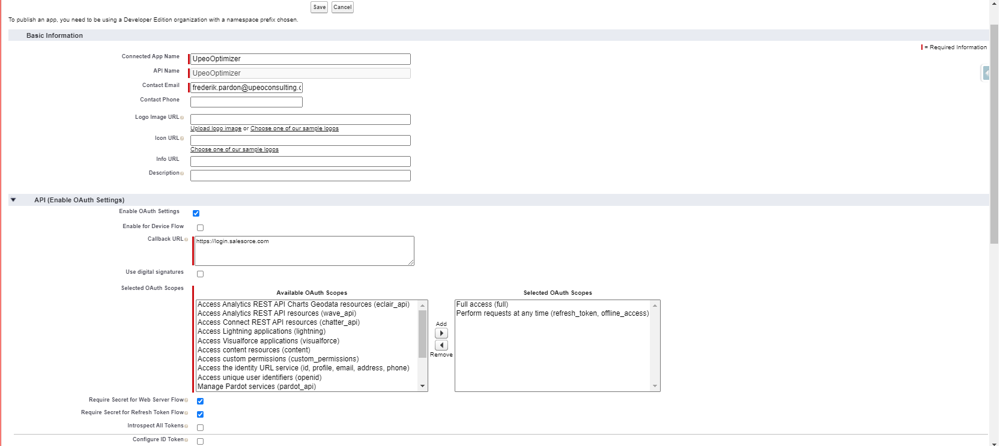

# UpeoOrgAnalyzer


```
Package Name: UpeoAnalyzer
Version: 1.0

A handy package for auditing your org.


Installation URL Prod: https://login.salesforce.com/packaging/installPackage.apexp?p0=04t09000000GEuD
Installation URL Sandbox: https://test.salesforce.com/packaging/installPackage.apexp?p0=04t09000000GEuD
Password: UpeoIsCool
Dependencies: none
```


After installing, you will need to create a Connected App, an Auth Provider and link a Named Credential in order to make the callouts work.

To work with REST API in LC you need to create three things -

Connected Apps
Auth Provider
Named Credentials (Already part of the package)

## Connected App

- Go to Setup, and enter 'App Manager' in the Quick Find box. Click on App Manager.


- Create a new Connected App and fill out:

  * Connected App Name: UpeoOptimizer
  * Contact Email: your email address
  * Check 'Enable OAuth Settings' under the API Section
  * Set a temporary URL as the Callback URL, we'll update that later (Eg https://login.salesorce.com)
  * Set 'Full Access (full)' and 'Perform requests at any time (refresh token, offline_access)' as the Selected OAUth Scopes
  * Leave the rest of the fields as they are
  * Save
  * Copy the Consumer Key and the Consumer Secret that is generated




## Auth Provider

- Enter Auth. Providers in the Quick Find box


- Create a new Auth. Provider
- Select Salesforce as the Provider Type
- Fill out the following:

  * Name: OptimizerUpeo
  * URL Suffix: OptimizerUpeo
  * Consumer Key: paste the Consumer Key from the Connected App you created here
  * Consumer Secret: paste the Consumer Secret from the Connected App you created here
  * Default scopes: refresh_token full (mind the _ and the space!)
  * Save

 

- Under the Section 'Salesforce Configuration' a number of links will be generated. Copy the Callback URL:


- Go back to the Connected App you created and update the Callback URL to the one you copied
- Save the Connected App


## Named Credential

- Enter Auth. Providers in the Quick Find box
- Open UpeoOptimizer
- Set the URL to your Org's Base URL
- Set the Identity Type to Named Principal
- Set the Authentication Protocal to 0Oath 2.0
- Click the looking glass next to Authentication Provider and Select the Auth Provider you just created
- Set the Scope to refresh_token full (mind the _ and the space!)
- Save


- You'll be redirected to a Login Screen.
- Login and Allow Access to the Application

You're done!

## Permission Set

Assign the UpeoAnalyzer Permission set to the users who need access


